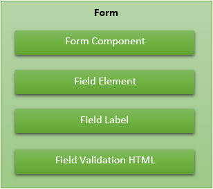
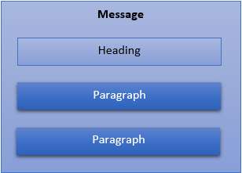
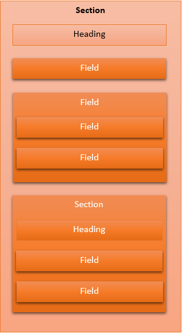
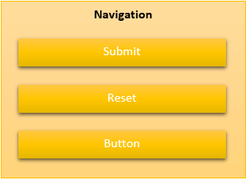

# Getting Started with Chameleon Forms

## What does ChameleonForms do for me?

Chameleon Forms provides an object hierarchy that allows you to declaratively specify the structure of your form. From there:

* It will output the boilerplate template of your form by way of a form template
* It will discern a number of defaults about each field based on inspecting the model metadata for each property
* It will allow you to tweak individual fields by chaining methods using the fluent api off of each field (and some other elements such as submit buttons) declaration
* If gives you the freedom to break out into HTML/Razor anywhere in the form when the template / built-in structures don't meet your needs

It makes use of convention over configuration, `using` statements and an opinionated structure (that is easy enough to opt out of or create your own structure if you like) to make each form consistent and demonstrating a minimum of repetition.

## Show me a basic ChameleonForms example next to it's ASP.NET MVC counterpart!

Say you had the following view model:

```csharp
    public class BasicViewModel
    {
        [Required]
        public string RequiredString { get; set; }

        public SomeEnum SomeEnum { get; set; }

        public bool SomeCheckbox { get; set; }
    }
```

And assuming for a moment you used definition lists to wrap your HTML fields then you might end up with something like this in your Razor view:

```html
@using (Html.BeginForm())
{
    <fieldset>
        <legend>A form</legend>
        <dl>
            <dt>@Html.LabelFor(m => m.RequiredString, "Some string")</dt>
            <dd>@Html.TextBoxFor(m => m.RequiredString) @Html.ValidationMessageFor(m => m.RequiredString)</dd>
            <dt>@Html.LabelFor(m => m.SomeEnum)</dt>
            <dd>@Html.DropDownListFor(m => m.SomeEnum, Enum.GetNames(typeof(SomeEnum)).Select(x => new SelectListItem {Text = ((SomeEnum)Enum.Parse(typeof(SomeEnum), x)).Humanize(), Value = x})) @Html.ValidationMessageFor(m => m.SomeEnum)</dd>
            <dt>@Html.LabelFor(m => m.SomeCheckbox)</dt>
            <dd>@Html.CheckBoxFor(m => m.SomeCheckbox) @Html.LabelFor(m => m.SomeCheckbox, "Are you sure?") @Html.ValidationMessageFor(m => m.SomeCheckbox)</dd>
        </dl>
    </fieldset>
    <div class="form_navigation">
        <input type="submit" value="Submit" />
    </div>
}
```

The equivalent of this form with out-of-the-box ChameleonForms functionality is:

```csharp
@using (var f = Html.BeginChameleonForm()) {
    using (var s = f.BeginSection("A form")) {
        @s.FieldFor(m => m.RequiredString).Label("Some string")
        @s.FieldFor(m => m.SomeEnum)
        @s.FieldFor(m => m.SomeCheckbox).InlineLabel("Are you sure?")
    }
    using (var n = f.BeginNavigation()) {
        @n.Submit("Submit")
    }
}
```

## How are ChameleonForms forms structured?

There is a general structure that ChameleonForms encourages with the out-of-the-box setup that can be described by the following diagrams. In reality you can use any structure you like and you can break out into plain old HTML any time you need to, but this explains the default structure that ChameleonForms empowers you to specify by default.

### Form

At the top level is the Form - a Form can have any number of Form Components underneath it or, for ultimate flexibility, the separate components that make up a Field on an ad hoc basis(using the Field Element, the Field Label and the Field Validation HTML).



The Form Components that come with ChameleonForms out of the box are:

* Message
* Section
* Navigation

To create a Form simply use the `BeginChameleonForms` extension method off of the Html helper:

```csharp
@using (var f = Html.BeginChameleonForm()) {
    @* The form ... *@
}
```

Random Field Elements, Field Labels and Field Validation HTML that don't fit in to a Section (see below) can be output from the Form object anywhere within your form like so:

```csharp
<p>@f.LabelFor(m => m.SomeCheckbox).Label("Hello!") @f.FieldFor(m => m.SomeCheckbox) @f.ValidationMessageFor(m => m.SomeCheckbox)</p>
```

### Message

At any point in the form you can create a Message component - a Message always has a type as well as a Heading and inside of the message you can add any content you like, but ChameleonForms gives you the option of easily specifying Message Paragraph's - the HTML for which is defined in your form template.



The message types available are:

* Action - User action required
* Success - Action successful
* Failure - Action failed
* Information - Informational message
* Warning - Warning message

You can output different HTML in your form template depending on the type of message (e.g. different class or completely different HTML structure).

To create a Message simply use the `BeginMessage` extension method off of the Form object:

```csharp
using (var m = f.BeginMessage(MessageType.Success, "Submission successful")) {
    @m.Paragraph("Some sort of success message")
    @* Other Paragraph's or any HTML at all really ... *@
}
```

### Section

A Section component holds a set of Fields (see below for definition of Field) or nested sections (to no more than one level deep). A Section will start with a Heading. The default form template that comes with Chameleon Forms defines a top-level section as a `fieldset`.



To create a Section simply use the `BeginSection` extension method off of the Form object (or off of the Section object to create a nested one):

```csharp
using (var s = f.BeginSection("Basic information")) {
    using (var ss = s.BeginSection("Nested section")) {
        @* Fields... *@
    }
    @* Fields... *@
}
```

### Field

A Field is a single data collection unit within a Section and comprises of an Element, a Label, Validation HTML and a Field Configuration.

Fields can have other Fields nested within them (to one level deep).

To create a Field simply use the `FieldFor` extension method off of the Section object or the `BeginFieldFor` extension method off of the Section object to start a Field with nested Fields:

```csharp
@s.FieldFor(m => m.SomeField).FieldConfigurationMethodsCanBeChainedOffOfTheEnd()
using (var ff = s.BeginFieldFor(m => m.AnotherField, Field.Configure().FieldConfigurationMethodsCanBeChainedHere()) {
    @ff.FieldFor(m => m.ChildField)
}
```

### Navigation

A Navigation component will usually be placed at the end of the form (although there is nothing stopping you placing it elsewhere or even multiple times on the form - e.g. top and bottom). The Navigation component allows you to easily create Submit buttons, Reset buttons and normal Buttons.



To create a Navigation simply use the `BeginNavigation` extension method off of the Form object:

```csharp
using (var n = f.BeginNavigation()) {
    @n.Submit("Submit").ChainHtmlAttributesOffOfTheEnd()
    @n.Reset("Reset").ChainHtmlAttributesOffOfTheEnd()
    @n.Button("A button").ChainHtmlAttributesOffOfTheEnd()
}
```

## What terminology is used in ChameleonForms?

Some of the terminology around the structure of ChameleonForms forms are defined above, but following is a more comprehensive list of terms that the library uses:

* Form - The container of a single form
* Form Component - Some sort of container nested within a Form
* Heading - A title given to a Form Component (not all Form Components have one though)
* Message - A message to show the user
* Message Paragraph - A discrete part of a message to show the user
* Section - A grouping for a set of Fields
* Field - A single data collection unit
* Field Element - The HTML that makes up a control to accept data from the user
* Field Label - Text that describes a Field Element to a user (and is linked to a Field Element)
* Field Validation HTML - Markup that acts as a placeholder to display any validation messages for a particular Field Element
* Field Configuration - The configuration for a particular Field, Field Element and/or Field Label
* Navigation - A grouping for a set of Navigation elements
* Navigation Submit - A button that will submit the form
* Navigation Reset - A button that will reset the form to it's initial state
* Navigation Button - A button that has a user-defined behaviour
* Field Generator - A class that generates HTML for a single Field
* Field Generator Handler - A class that generates HTML for a particular type of Field Element
* Form Template - A class that defines the HTML boilerplate to render Forms, Form Components, Fields and Navigation elements
* HTML Attributes - A class that defines a set of HTML attributes to apply to a HTML element

## Namespaces in Views/web.config

A lot of the functionality in ChameleonForms is exposed as extension methods to allow flexibility for people to define their own extension methods and extend the default behaviour of ChameleonForms. This has the downside that a lot of the functionality of ChameleonForms isn't discoverable unless you have `using` statements for the correct namespaces in your page. Having to remember to add these to each page is tedious, repetitive and not discoverable.

To overcome this problem, ChameleonForms will (when installed via NuGet) look for a `Views\web.config` file and apply an XML transformation to add the following namespaces so they are available automatically from every page in your application:

* `ChameleonForms`
* `ChameleonForms.Component`
* `ChameleonForms.Enums`

If you use a Form Template with template-specific extension methods then we recommend that you add the namespace(s) involved in your `Views\web.config` file rather than namespaces in each view - that way you can easily swap Form Templates.